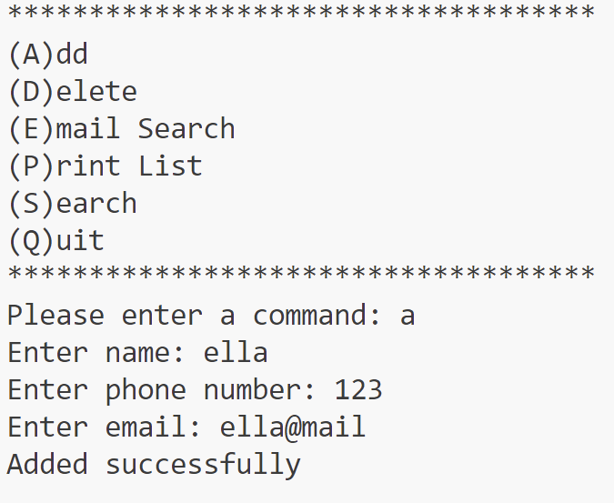
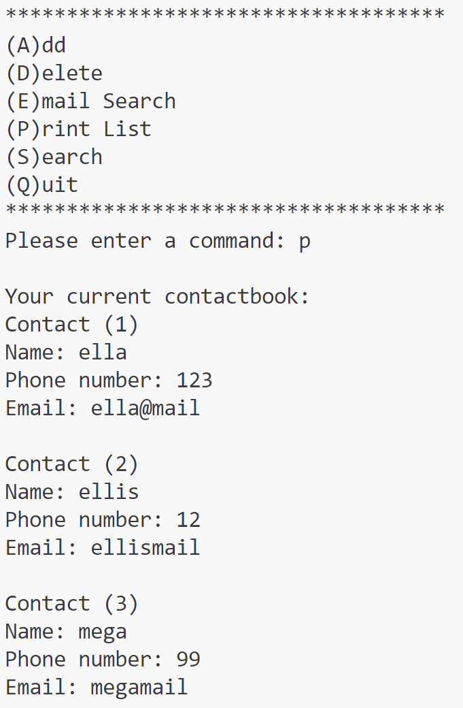
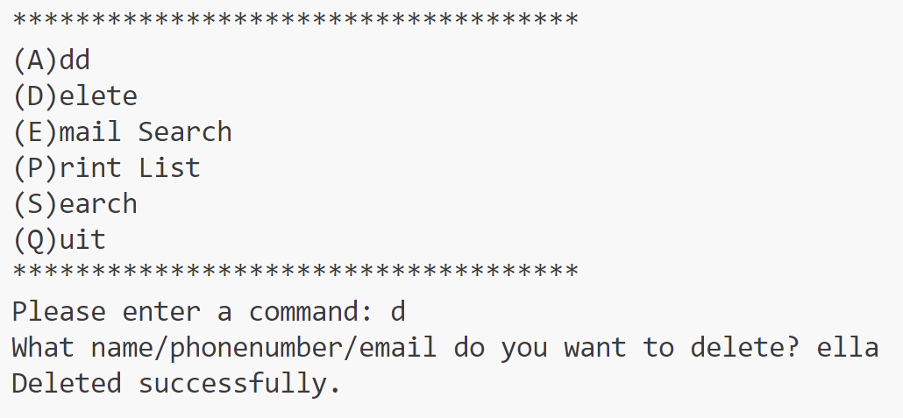
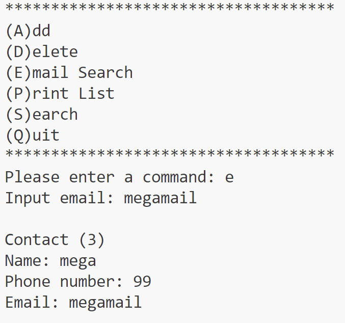
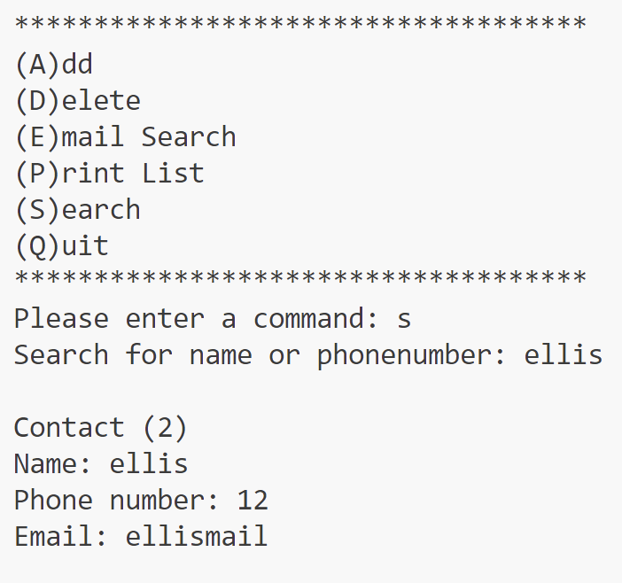

# Data Structure Assignment - Week 4

**Name:** Ellis Raputri

**Class:** L2AC

**ID Number:** 2702298116

 

## Brief Description
This repository cointains the phonebook exercise for Data Structure Lecture. It is an exercise of Linked List implementation in Java. In this exercise, the java.util.LinkedList API is used. This repository has a driver class (ContactBook.java) and a file contains the class Contact (Contact.java). 

 

## Files
- ContactBook.java - the driver and main class
- Contact.java - the file contains class Contact

 

## Output Screenshots

Here are some of the outputs from running ContactBook.java file:

 

